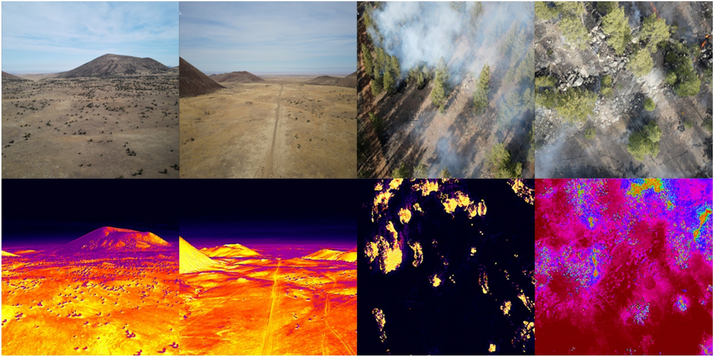

# Abstract
Current forest monitoring technologies including satellite remote sensing, manned/piloted aircraft, and observation towers leave uncertainties about a wildfire's extent, behavior, and conditions in the fire's near environment, particularly during its early growth. Rapid mapping and real-time fire monitoring can inform in-time intervention or management solutions to maximize beneficial fire outcomes. Drone systems' unique features of 3D mobility, low flight altitude, and fast and easy deployment make them a valuable tool for early detection and assessment of wildland fires, especially in remote forests that are not easily accessible by ground vehicles. In addition, the lack of abundant, well-annotated aerial datasets -- in part due to unmanned aerial vehicles' (UAVs') flight restrictions during prescribed burns and wildfires -- has limited research advances in reliable data-driven fire detection and modeling techniques. While existing wildland fire datasets often include either color or thermal fire images, here we present (1) a multi-modal UAV-collected dataset of dual-feed side-by-side videos including both RGB and thermal images of a prescribed fire in an open canopy pine forest in Northern Arizona and (2) a deep learning-based methodology for detecting fire and smoke pixels at accuracy much higher than the usual single-channel video feeds.  The collected images are labeled to "fire" or "no-fire" frames by two human experts using side-by-side RGB and thermal images to determine the label. To provide context to the main dataset's aerial imagery, the included supplementary dataset provides a georeferenced pre-burn point cloud, an RGB orthomosaic, weather information, a burn plan, and other burn information. By using and expanding on this guide dataset, research can develop new data-driven fire detection, fire segmentation, and fire modeling techniques.

<!-- [Paper link:](http://academicpages.github.io/files/paper3.pdf) -->

<!-- Recommended citation: Your Name, You. (2015). "Paper Title Number 3." <i>Journal 1</i>. 1(3). -->

## Background
In this project, we propose a drone-based wildfire monitoring system for remote and hard-to-reach areas. This system utilizes autonomous unmanned aerial vehicles (UAVs) with the main advantage of providing on-demand monitoring service faster than the current approaches of using satellite images, manned aircraft and remotely controlled drones.

Avalible datasets for now:
<a href="https://ieee-dataport.org/open-access/flame-dataset-aerial-imagery-pile-burn-detection-using-drones-uavs">THE FLAME DATASET: AERIAL IMAGERY PILE BURN DETECTION USING DRONES (UAVS)</a>

More information, please reference our previous paper:
<a href="https://ieeexplore.ieee.org/abstract/document/8845309">Wildfire Monitoring in Remote Areas using Autonomous Unmanned Aerial Vehicles</a>

## Flame Detection
This module only uses image processing method to detect flame zone on IR pictures, then draw bounding boxes on related RGB images.

For codes, please go to: [Flame_detection](Flame_detection)

<!--  -->

## Flame Images Generating
This module uses GAN-based deep learning method to generate RGB flame images from given IR image. For example, input an arbitrary IR image of wildfire, the model will generate a virtual RGB image to describe the fire situation.

This part is only on experimental stage, but it's good to research the relationship between the wildfire and its smoke.

For codes, please go to: [Flame_GAN](Flame_GAN)

<!--  -->

## Contributing
This project is contributed by: 
<a href="hao9@g.clemson.edu">hao9@clemson.edu</a>
<a href="xiwenc@g.clemson.edu">xiwenc@clemson.edu</a>
<a href="bryceh@g.clemson.edu">bryceh@clemson.edu</a>

### Please cite our work if you think this project helps your research.

